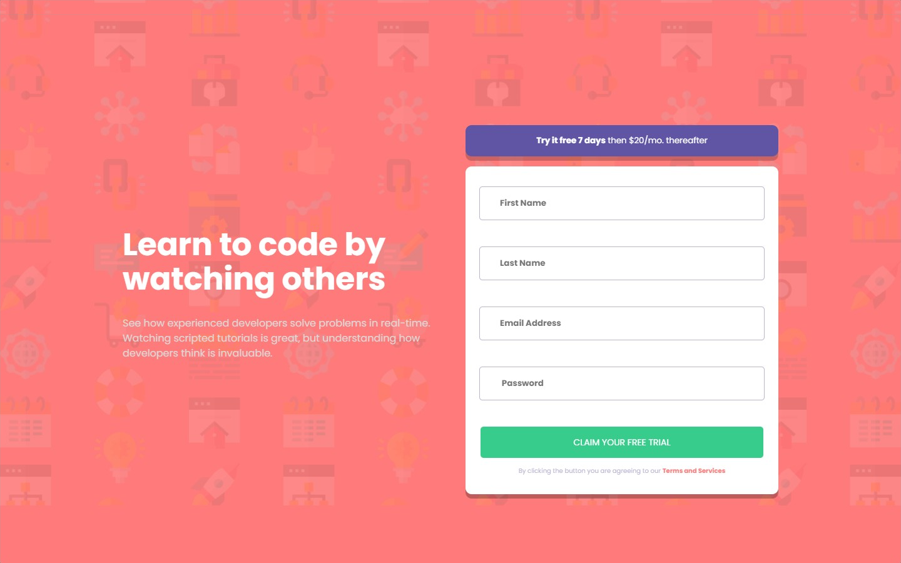
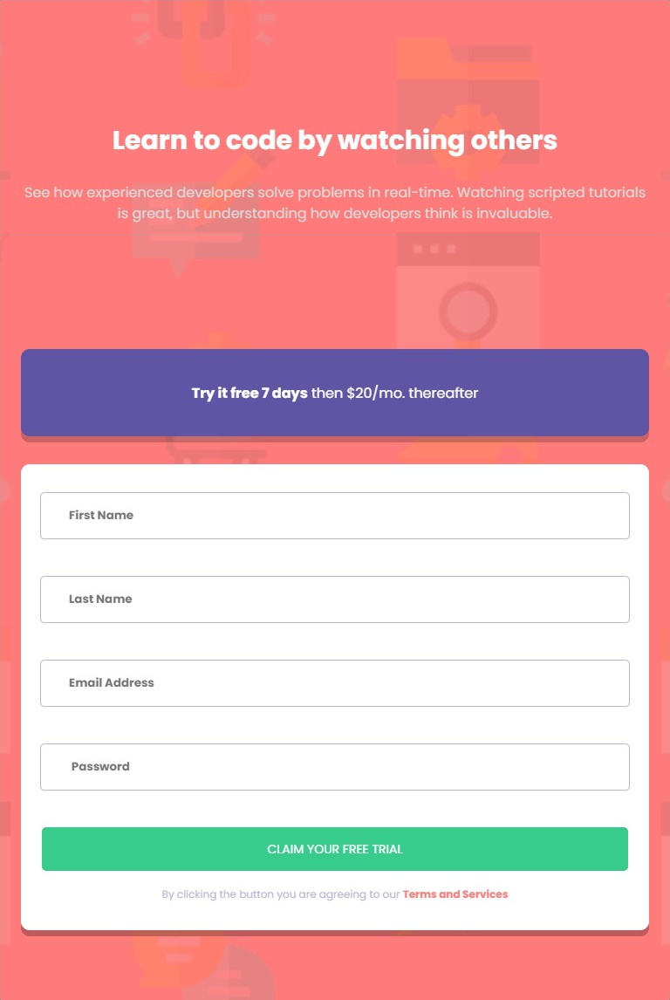

# Frontend Mentor - Social proof section

Esta é uma solução para o [Intro component with signup](https://www.frontendmentor.io/challenges/intro-component-with-signup-form-5cf91bd49edda32581d28fd1). Os desafios do Frontend Mentor ajudam você a melhorar suas habilidades de codificação ao construir projetos realistas.

## Resumo de conteúdos

- [Visão Geral](#Visão-Geral)
  - [O desafio](#O-desafio)
  - [Captura de tela](#Captura-de-tela)
  - [Links](#Links)
- [Meu processo](#Meu-processo)
  - [Construído com](#Constrído-com)
  - [O que eu aprendi](#O-que-eu-aprendi)
  - [Continuação dos desenvolvimentos](#Continuação-dos-desenvolvimentos)
  - [Recursos utilizados](#Recursos-utilizados)
- [Autor](#Autor)

## Visão Geral.

### O desafio

Os usuários devem ser capazes de:

- Veja estados de foco para elementos interativos.
- Criação de um cartão de informações.
- Observar um design responsivo.
- Validação de erro do formulário.
- Estilização dos campos required.
- Validação dos campos individualmente.

### Captura de tela

- Desktop
<p  align="center" >
  
</p>

- Tablet
<p  align="center" >

</p>

- Mobile
<p  align="center" >

</p>

- Gif
<p  align="center" >

</p>

### Links

- Solução URL: [https://github.com/michelwene/intro-component-with-signup-form](https://github.com/michelwene/intro-component-with-signup-form)
- Site URL: [https://michelwene.github.io/social-proof-section-master/](https://michelwene.github.io/social-proof-section-master/)

## Meu processo

### Construído com

- HTML5
- CSS3
- Flexbox
- Grid
- Design responsivo
- EMMET
- JavaScript

### O que eu aprendi

```html
<h1>Algum código HTML de que me orgulho</h1>
<form class="formulario__conteudo">
              <div class="input">
                <input
                  type="text"
                  name="fname"
                  placeholder="First Name"
                  class="formulario__input"
                  required
                />
                <span class="error"></span>
              </div>

              <div class="input">
                <input
                  type="text"
                  name="lname"
                  placeholder="Last Name"
                  class="formulario__input"
                  required
                />
                <span class="error"></span>
              </div>

              <div class="input">
                <input
                  type="email"
                  name="email"
                  id="email"
                  class="formulario__input"
                  placeholder="Email Address"
                  required
                />
                <span class="error"></span>
              </div>

              <div class="input">
                <input
                  type="password"
                  name="password"
                  placeholder=" Password"
                  class="formulario__input"
                  required
                />
                <span class="error"></span>
              </div>

              <div class="input">
                <button type="submit" class="formulario__prosseguir">
                  CLAIM YOUR FREE TRIAL
                </button>
              </div>
            </form>

<!-- Neste HTML estruturei de uma forma em que eu consegui nomear as tags e separar os inputs da melhor forma que eu achei para realizar as funções no JavaScript, com ele bem estruturado, consegui montar o JavaScript e o CSS bem rápido.-->
```

```javaScript
function customMessage(typeError) {
    const messages = {
      fname: {
        valueMissing: "First name cannot be empty",
      },
      lname: {
        valueMissing: "Last name cannot be empty",
      },
      email: {
        valueMissing: "Looks like this is not an email",
        typeMismatch: "email@example/com",
      },
      password: {
        valueMissing: "Password cannot be empty",
      },
    };

    return messages[field.name][typeError];
  }
/* função magnifica que utilizei para realizar a troca da mensagem do campo required de cada input, ou seja, cada input ficou com mensagem de required diferente.*/

  function setCustomMessage(message) {
    const spanError = field.parentNode.querySelector("span.error");
    const inputEmail = document.getElementById("email");

    if (message) {
      spanError.classList.add("active");
      spanError.innerHTML = message;

      if (message == "Looks like this is not an email") {
        inputEmail.placeholder= "email@example/com";
        field.style.placeholder = "var(--cor-vermelho)";
      }
    } else {
      spanError.classList.remove("active");
      spanError.innerHTML = "";
    }
  }

  /*Neste função também foi uma experiência gigantesca, consegui fazer com que os campos verificassem os erros e se ele estivesse com erro ou não ele tomaria medidas diferentes de acordo com o valor atual do input*/
```

### Continuação dos desenvolvimentos

Pretendo continuar fazendo projetos do FrontendMentor, para melhorar meu HTML, CSS, JavaScript.

### Recursos utilizados

- [Stackoverflow](https://stackoverflow.com/) - Este site me ajudou muito na realização as funções do javascript.
- [Github](https://gist.github.com/maykbrito/951c41c1ecd87ccfcff443a38e79712f) - Este repositório foi a minha principal ajuda para realização deste projeto, nele eu consegui realizar as funções e as tratativas de acordo com meu projeto, tendo como base este repositório do Github.

## Autor

- Frontend Mentor - [@michelwene](https://www.frontendmentor.io/profile/michelwene)
- Linkedin - [@michelwene](https://www.linkedin.com/in/michelwene/)
